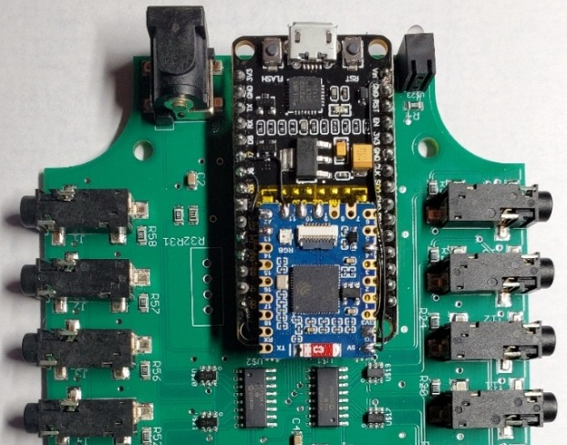

# IoTaWatt ESPHome Component (ESP32-S3 Swap)

This project provides a custom ESPHome component for the [IoTaWatt](https://iotawatt.com/) energy monitor, specifically designed for when the original microcontroller is swapped for an **ESP32-S3**.

## Required Hardware changes

- Remove original ESP8266
- Connect SPI pins to ESP32-S3
- Connect ADC CS pins to ESP32-S3
- Remove SD Card or force SD Card CS pin to high
- Connect VCC and GND to ESP32-S3

Modified PCB with ESP32-S3-Tiny board by Waveshare:


When using an ESP32-S3 module with its own LDO, it is recommended to use USB 5V to power the module, as it provides cleaner power for the ADC.

## Overview

The IoTaWatt hardware normally uses an ESP8266. This project allows upgrading the hardware to an ESP32-S3 and integrating it directly into the ESPHome ecosystem for better performance and seamless Home Assistant integration with MQTT.

This component focus on **high-frequency power sampling**. It does not include native support for the SD Card or RTC, as these features can be added using standard ESPHome `sdcard` and `time` components if required.

## Configuration

To use this component, add it to your ESPHome configuration using `external_components`.

```yaml
external_components:
  - source:
      type: git
      url: https://github.com/pawel-sw/esphome-iotawatt
```

The component is configured as a sensor platform. You must define the SPI pins and the inputs (channels) in your YAML file. When migrating from the original ESP8266 version, the configuration is very similar to the `config.txt` file of the IoTaWatt SD card.

See `PHASE_TABLES` in [sensor.py](components/iotawatt/sensor.py) for a list of supported VT and CT models.

> [!IMPORTANT]
> **Technical Note on Sampling Rate**: The `read_adc_fast` function in `iotawatt.cpp` is highly optimized using direct hardware register access specifically for the **ESP32-S3**. This allows for extremely high sampling rates (~32kHz). If using other ESP32 family chips (like the original ESP32, S2, or C3), this function may need to be adjusted.

### Example Configuration

```yaml
sensor:
  - platform: iotawatt
    id: my_iotawatt
    update_interval: 30s
    clk_pin: 12
    mosi_pin: 11
    miso_pin: 13
    cs_pin_0: 9
    cs_pin_1: 10
    inputs:
      - channel: 0
        name: "Reference"
        type: "VT"
        model: "JW-95001-NA"
        cal: 11.12
        voltage:
          name: "Reference Voltage"
        frequency:
          name: "Reference Frequency"
      - channel: 1
        name: "Main L1"
        type: "CT"
        model: "AcuCT-H100-200"
        reverse: true
        power:
          name: "L1 Power"
          id: l1_power
        current:
          name: "L1 Current"
        power_factor:
          name: "L1 PF"
      - channel: 2
        name: "Main L2"
        type: "CT"
        model: "AcuCT-H100-200"
        reverse: true
        power:
          name: "L2 Power"
          id: l2_power
        current:
          name: "L2 Current"
        power_factor:
          name: "L2 PF"
      - channel: 13
        name: "Dryer"
        type: "CT"
        model: "AcuCT-H063-100"
        double: true
        vphase: 120.0
        power:
          name: "Dryer Power"
        current:
          name: "Dryer Current"

  - platform: template
    name: "Total Power"
    id: total_power
    unit_of_measurement: "W"
    lambda: |-
      return id(l1_power).state + id(l2_power).state;
```

## Future Improvements

- **Simultaneous Sampling via DMA**: The sampling rate could be further increased by using the ESP32-S3's LCD/Camera peripheral in DMA mode to drive bit-banged SPI. By sharing SCK and MOSI pins while using dual CS and dual MISO pins, two ADCs could be read simultaneously.
- **Framework Constraints**: Implementation of the above is currently hindered by the removal of the I2S/Parallel LCD driver from official ESP-IDF versions, requiring the use of unstable or internal HAL components.

## Credits

Based on the original IoTaWatt logic but adapted for ESPHome and ESP32-S3 hardware swaps.

